1. Giới thiệu dự án

Đây là một dự án Web Bán Nhạc Cụ. Là một hệ thống thương mại điện tử chuyên cung cấp các loại nhạc cụ và phụ kiện dành cho người yêu âm nhạc. Với mục tiêu mang đến trải nghiệm mua sắm trực tuyến tiện lợi và thân thiện, hệ thống được phát triển dựa trên các công nghệ hiện đại, đảm bảo hiệu năng và tính bảo mật. Dự án không chỉ hướng đến việc cung cấp nhạc cụ mà còn tạo một cộng đồng kết nối những người yêu âm nhạc. Việc sử dụng Laravel giúp đảm bảo hệ thống có cấu trúc rõ ràng, dễ bảo trì và mở rộng trong tương lai.

Công nghệ sử dụng
PHP: Ngôn ngữ lập trình server-side mạnh mẽ, linh hoạt, phù hợp để xây dựng các ứng dụng web động.
Laravel: Framework PHP phổ biến với các tính năng tiên tiến như Routing, Eloquent ORM, và Blade Template, giúp tăng tốc độ phát triển và quản lý dự án.
MySQL: Hệ quản trị cơ sở dữ liệu mạnh mẽ, dùng để lưu trữ và quản lý thông tin sản phẩm, đơn hàng và người dùng.

2. Người thực hiện

Họ và tên: Đỗ Huy Dương

Mã sinh viên: 22010179

Ngành học: CNTT

3. Sơ đồ khối UML

  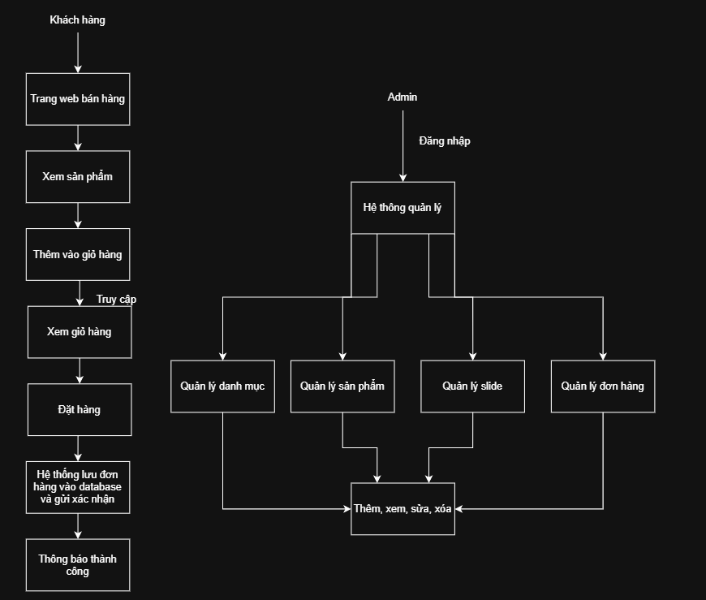
  
  Sơ đồ UML của trang web

4. Sơ đồ các chức năng UML

* Đăng nhập

  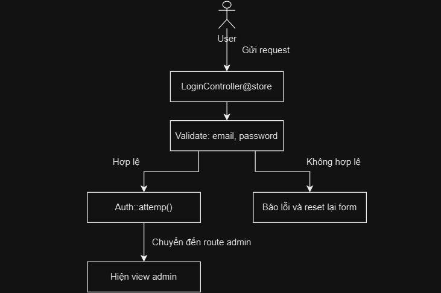
  
  Sơ đồ UML chức năng đăng nhập trang admin

* Create (product)

  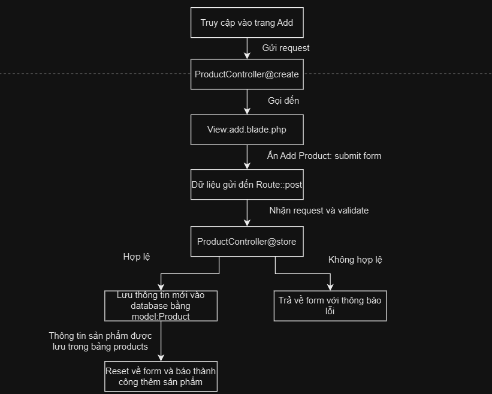
  Sơ đồ UML chức năng thêm sản phẩm

* Read (product)

  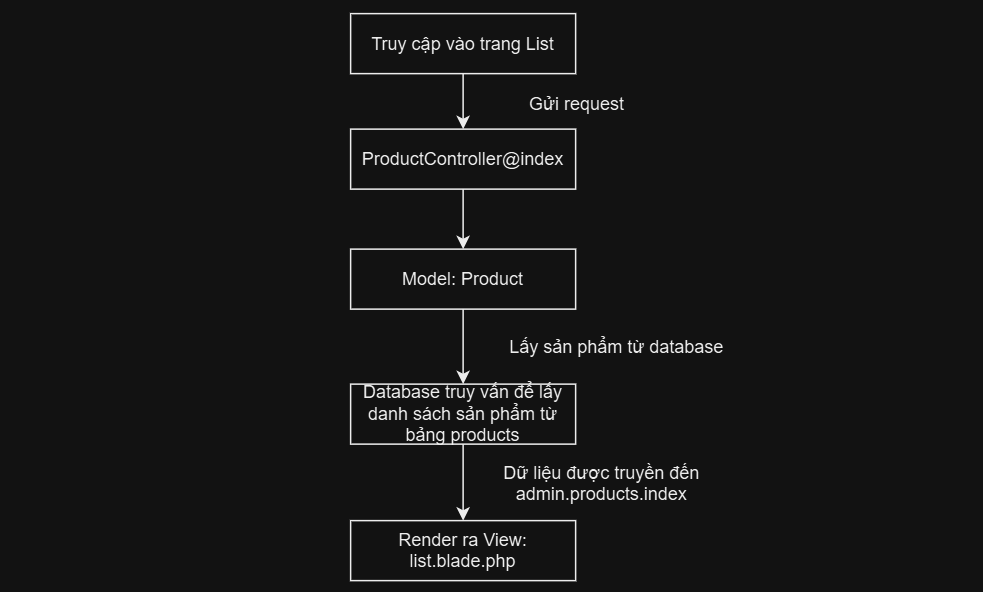
  Sơ đồ UML chức năng xem sản phẩm

* Update (product)

  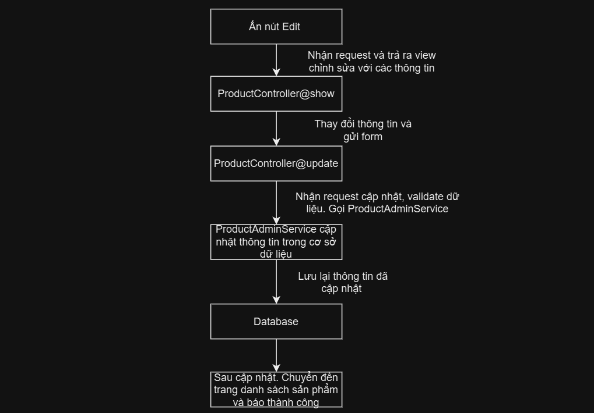
  Sơ đồ UML chức năng sửa sản phẩm

* Delete (product)

  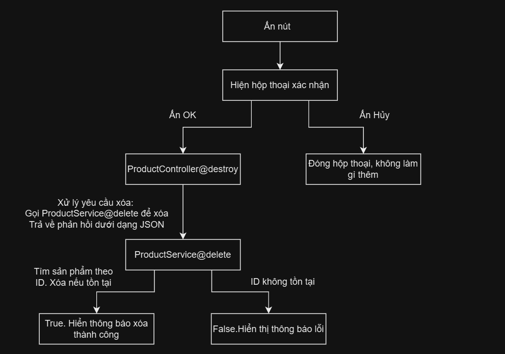
  Sơ đồ UML chức năng xóa sản phẩm

* Upload 

  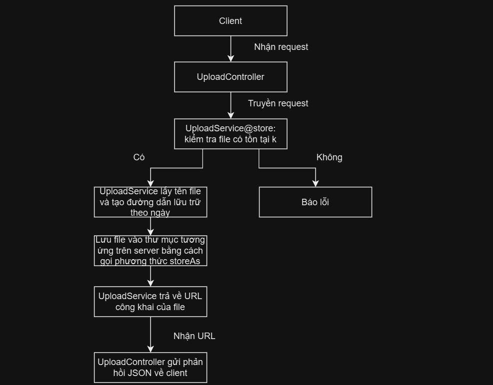
  Sơ đồ UML chức năng upload ảnh

* Cart

  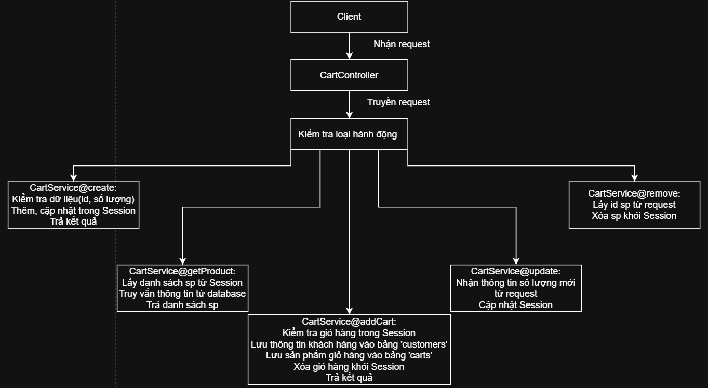
  Sơ đồ UML chức năng order sản phẩm trong giỏ hàng

5. Giao diện trang web

* UI đăng nhập

  

* UI trang admin

  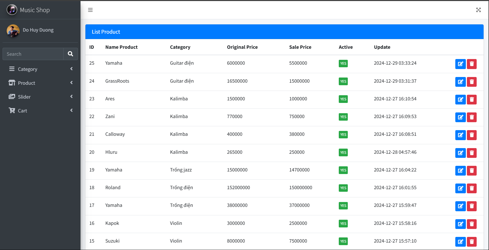

* UI trang bán hàng

  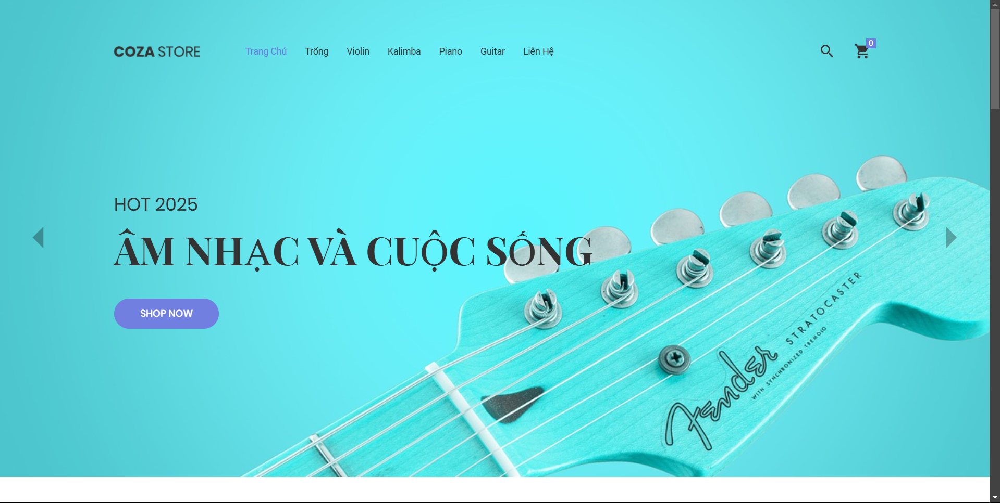

* UI sản phẩm

  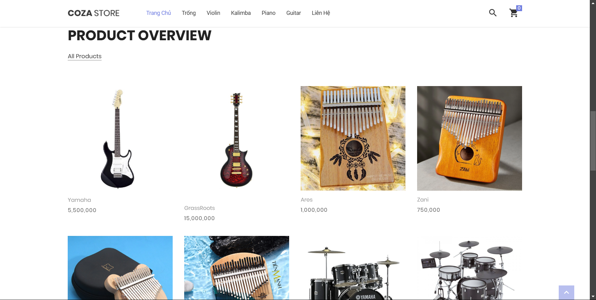

* UI giỏ hàng

  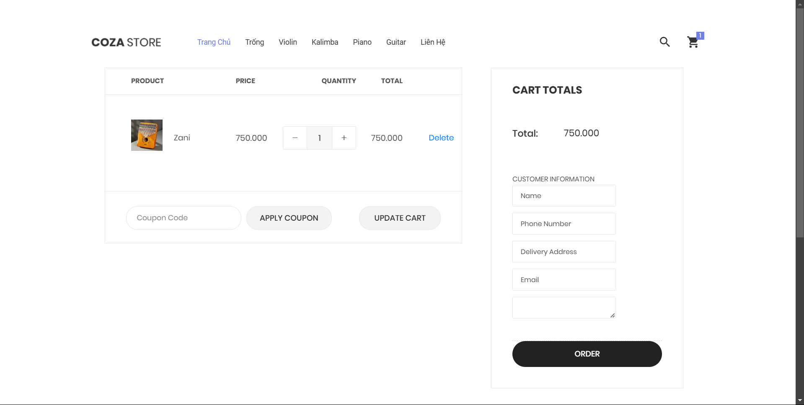

6. Link deploy
